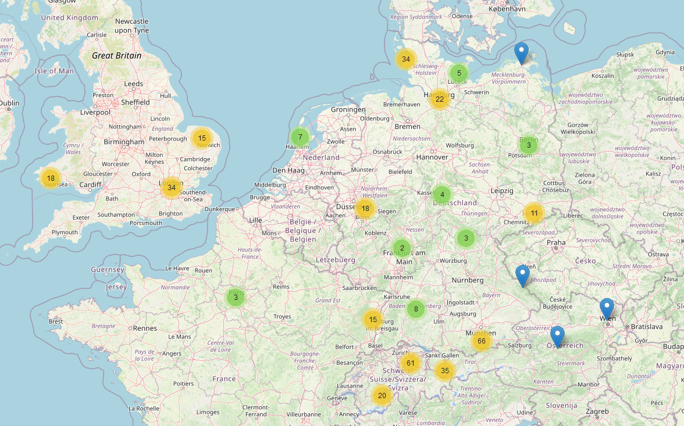

# This is your life


[](https://sonarcloud.io/summary/new_code?id=mu88_Project28)
[](https://sonarcloud.io/summary/new_code?id=mu88_Project28)
[](https://sonarcloud.io/summary/new_code?id=mu88_Project28)
[](https://sonarcloud.io/summary/new_code?id=mu88_Project28)
[](https://sonarcloud.io/summary/new_code?id=mu88_Project28)
[](https://sonarcloud.io/summary/new_code?id=mu88_Project28)
[](https://sonarcloud.io/summary/new_code?id=mu88_Project28)
[](https://dashboard.stryker-mutator.io/reports/github.com/mu88/ThisIsYourLife/main)

This repo contains a web application to remember of special moments of your life as a photo diary. You can create so called _lifepoints_ on a map and link them to a photo with a description.

## Motivation

I wrote this app for my wife's birthday so that all of her friends could create lifepoints of moments they shared with each other. In the end, I merged all data, resulting in the following map:


There are other apps out there doing basically the same, but most of them are using some sort of not E2E-encrypted cloud storage which I didn't want to use due to privacy concerns. Therefore, this app solely stores its data locally.

## Technology

The app is based on the following technologies and frameworks:

- ASP.NET Core Server-side Blazor (application and UI logic)
- SQLite (persistence)
- Leaflet (map content)

## User files

As mentioned before, all data are stored locally in an application's subfolder `data` (e. g. `C:\temp\ThisIsYourLife\data`). It contains the following files and folders:

- `user.json` → contains the username that will be entered on application startup and a unique user ID.
- `db` → contains the SQLite database `ThisIsYourLife.db` with the created lifepoints.
- `images\<<ID>>` → contains the uploaded and resized photos.
- `logs` → contains log files `ThisIsYourLife<<date>>.log`.

## Local development

Since it is a regular .NET application, it can be run via `dotnet run` or using an IDE. The SQLite database will be created automatically in the application directory.

## Deployment

The app is deployed both as a [self-contained executable](https://docs.microsoft.com/en-us/dotnet/core/deploying/#publish-self-contained) and the Docker image [`ghcr.io/mu88/thisisyourlife`](https://ghcr.io/mu88/thisisyourlife).

The application's URL is http://localhost:5000/thisIsYourLife.

### Self-contained executable

Use the following command to generate the app:

```shell
dotnet publish src/WebApp/WebApp.csproj -r win-x64 -p:PublishSingleFile=true -p:Configuration=Release --self-contained true
```

### Docker

Use the following command to generate the Docker image:

```shell
docker build -f ./src/WebApp/Dockerfile -t thisisyourlife:latest .
```

And for running the Docker container:

```shell
docker run -d -p 5000:80 --name thisisyourlife thisisyourlife:latest
```

## App configuration

Within `appsettings.json`, the following app parameters can be controlled:

- `CanDelete` → Boolean parameter indicating whether lifepoints can be deleted.

## Supported platforms

The app is running on my Raspberry Pi 4 Model B (Raspberry Pi OS x64) using Docker and on Windows using the self-contained executable. Since it does not contain any platform-specific code, it can run on any platform that supports .NET.

There is a [little user manual](docs/manual_DE.md), written in German.
