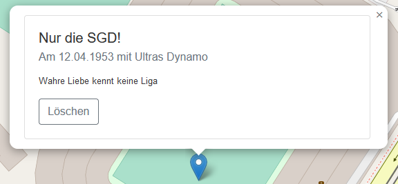
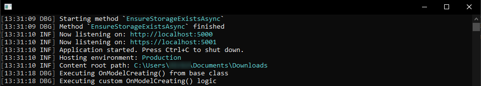
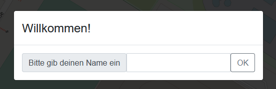
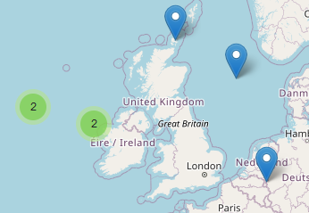
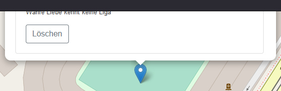

# This is your life
Die Idee hinter der App ist eine Art digitales Tourenbuch, bestehend aus kleinen Geschichten und optional einem dazugehörigen Bild. Dafür werden sog. _LifePoints_ erfasst, welche aus folgenden Daten bestehen:
- Titel (max. 50 Zeichen lang)
- Beschreibung (max. 500 Zeichen lang)
- Datum
- Optional: Bild (max. 15 MiB groß)

Nachfolgend ist ein beispielhafter LifePoint dargestellt: 

## Datenhaltung
Da in der App tendenziell private Daten erfasst werden, geschieht das Speichern lokal auf dem Computer der Benutzer:in. Es verlassen keine Daten das lokale Gerät, bspw. in die Cloud.

Von allen hochgeladenen Bildern wird eine Kopie erzeugt. Die Bilder werden auf 600 px heruntergerechnet, um das Datenvolumen kompakt zu halten.

Die Textdaten (Titel, Beschreibung, Datum) werden in einer lokalen SQLite-Datenbank gespeichert.

## Inbetriebnahme
Es handelt sich um eine Web-App, die auf allen Desktop-Betriebssystemen läuft (Windows, Linux, macOS). Sie steht für Windows zur Verfügung, kann aber sehr leicht für Linux nachgereicht werden. Bei Bedarf einfach mit mir Kontakt aufnehmen.

### Download
Die aktuellste Version kann von [hier](https://github.com/mu88/ThisIsYourLife/releases/latest) heruntergeladen werden. Einfach die ZIP-Datei `ThisIsYourLife.<<Version>>.zip` herunterladen und merken, wo man sie abspeichert 😉 Für diese Anleitung gehen wir von `C:\temp` aus.

Nach dem Herunterladen den Ordner öffnen, in den die ZIP-Datei heruntergeladen wurde, und sie entpacken. In Windows geht das wie [hier](https://support.microsoft.com/de-de/windows/zippen-und-entzippen-von-dateien-f6dde0a7-0fec-8294-e1d3-703ed85e7ebc) unter _Entzippen von Dateien_ beschrieben. Für diese Anleitung gehen wir davon aus, dass die Datei nach `C:\temp\ThisIsYourLife` entpackt wurde.

### Start
Im Ordner, in den die Dateien entpackt wurden, befinden sich diverse Dateien, u. a.:
- `Start me.bat`
- `WebApp.exe`

Mit diesen beiden Dateien kann die App auf zwei unterschiedlichen Wegen gestartet werden. Keiner der Wege hat irgendwelche Auswirkungen auf die App - es geht nur um Bequemlichkeit. In beiden Fällen wird sich ein Fenster öffnen, das in etwa so aussieht: 

Der Inhalt kann etwas variieren. Dieses Fenster muss geöffnet bleiben, solange man mit der App arbeiten möchte.

Unter Windows kann es auf beiden Wegen vorkommen, dass sich einmalig eine Warnung à la _Der Computer wurde durch Windows geschützt_ oder _Windows SmartScreen_ öffnet. Mit [diesem Trick](https://www.pctipp.ch/praxis/windows/windows-10-programm-trotzdem-ausfuehren-2006472.html)  lässt sich die App trotzdem starten.

#### Start mit `WebApp.exe`
- Die App `WebApp.exe` per Doppelklick starten und fünf bis zehn Sekunden warten. 
- Einen Browser der Wahl (Firefox, Chrome, Edge) öffnen und http://localhost:5000/thisIsYourLife aufrufen.

#### Start mit `Start me.bat`
- Das Skript `Start me.bat` per Doppelklick starten. Die App `WebApp.exe` wird gestartet und ein Fenster öffnet sich.
- Nach zehn Sekunden öffnet sich der eigene Standard-Browser (Firefox, Chrome, Edge) und ruft die Adresse http://localhost:5000/thisIsYourLife auf.

### Stop
Für das Beenden der App im Browser den Tab/das Fenster mit der App schließen und das Konsolenfenster von `WebApp.exe` beenden (wie gewohnt über das _x_ rechts oben).

Es muss nicht gespeichert werden, dies geschieht automatisch.

## Bedienung
### Erster Start
Beim erstmaligen Starten der App erscheint folgender Dialog: 

Hier bitte den eigenen Name eingeben (Leerzeichen und Emojis werden unterstützt). Unter diesem Name werden die LifePoints abgespeichert und später angezeigt.

Beim allerersten Start wird automatisch ein beispielhafter LifePoint im Herzen Dresdens erstellt ⚽🖤💛

### Anzeige
Die Bedienung sollte (hoffentlich 🤞🏻) intuitiv sein und sich an anderen Karten-Apps (bspw. Google Maps) orientieren.

Die App startet immer am gleichen Ort. Über die ➕ bzw. ➖-Buttons links oben bzw. das Mausrad kann ein- oder ausgezoomt werden. Durch Verschieben mit gedrückter linker Maustaste lässt sich der Kartenausschnitt verschieben. 

Bestehende LifePoints werden durch blaue Marker dargestellt. Über einen Linksklick auf den Marker können die Details inkl. des Bildes angezeigt werden.

Befinden sich zu viele LifePoints zu nah beieinander, werden diese gruppiert: 

Man kann entweder manuell hineinzoomen oder ein Cluster anklicken, dann wird automatisch hineingezoomt.

### Erfassung
Neue LifePoints können durch einen Doppelklick mit der linken Maustaste in der Karte erfasst werden.

Anschließend werden die Daten eingegeben, nach Wunsch ein Bild hochgeladen und der neue LifePoint durch einen Klick auf _Speichern_ abgespeichert.

Leerzeichen und Emojis werden unterstützt, ebenso wie mehrzeiliger Text in der Beschreibung

### Bekannte Probleme
Aufgrund eines Bugs kommt es vor, dass die Popups eines bestehenden oder neu zu erfassenden LifePoints sich außerhalb des Bildschirms öffnen: 

Da bin ich noch dran und hoffe, bald eine Lösung zu finden. Bis dahin muss man die Karte im Hintergrund manuell verschieben, bis der gesamte Popup zu sehen ist.

## Benutzerdateien
Wie bereits erwähnt, werden alle Daten lokal gespeichert, und zwar im Unterordner `data` (bspw. `C:\temp\ThisIsYourLife\data`). Darin befinden sich folgende Dateien und Ordner:
- `user.json` → enthält Benutzername, der beim Programmstart eingegeben wurde, und eine persönliche ID.
- `db` → enthält die SQLite-Datenbank `ThisIsYourLife.db` mit den erstellten LifePoints.
- `images\<<ID>>` → enthält die hochgeladenen und verkleinerten Bilder.
- `logs` → enthält Dateien `ThisIsYourLife<<Datum>>.log`, in denen bspw. etwaige Fehler protokolliert werden.

## Logging
Wichtige Vorgänge werden in Log-Dateien unter `data\logs\ThisIsYourLife<<Datum>>.log` protokolliert. Diese Log-Dateien enthalten keine unmittelbaren persönlichen Daten, sondern lediglich IDs.

Falls ein Problem auftritt, wäre ich sehr dankbar, wenn man mir die Log-Dateien zukommen lässt. Dies hilft mir, das Problem einzugrenzen und die App weiterzuentwickeln.

Eine automatische Übertragung irgendwelcher Daten im Hintergrund findet nicht statt.

## Trivia
### Warum keine mobile App für Android/iOS?
Da es sich um eine Web-App handelt, kann diese auch grundsätzlich mit dem Browser auf dem Smartphone/Tablet verwendet werden. Bei mir daheim betreibe ich die App tatsächlich auch so.

Da die Daten jedoch lokal auf dem Gerät erfasst werden (unter Android/iOS wäre das dann das Smartphone), müssten die LifePoint-Daten von dort weiter übertragen werden. Das erschien mir zu umständlich, zumal die meisten Leute die Bilder, die in LifePoints verwendet werden, vermutlich eh nicht auf dem Smartphone/Tablet haben.

Eine andere Option wäre gewesen, die App in der Cloud zu hosten. Aus Datenschutzgründen habe ich mich jedoch dagegen entschieden.

### Dankeschön / Thank you
Ein großes Dankeschön geht an Felix, Olaf und Thomas (Nennung in alphabetischer Reihenfolge, nicht der Wichtigkeit nach 😉)! Euer Feedback war sehr wertvoll und hat noch zu einigen schönen Features geführt.

Big thanks to [@SteveSandersonMS](https://github.com/SteveSandersonMS), [@danroth27](https://github.com/danroth27), [@IvanSanchez](https://github.com/IvanSanchez) and [@javiercn](https://github.com/javiercn) for your support in all questions related to Blazor and Leaflet and the awesome frameworks you provide!

## Nerd Stuff 🤓
Es handelt sich um eine [Blazor Server App](https://docs.microsoft.com/en-us/aspnet/core/blazor/?view=aspnetcore-6.0#blazor-server). Die Kartenbestandteile wurden mit [Leaflet](https://leafletjs.com/) implementiert.

Die App kann auch unter Docker auf einem Raspberry Pi betrieben werden. Das Docker Image befindet sich [hier](https://hub.docker.com/repository/docker/mu88/thisisyourlife).